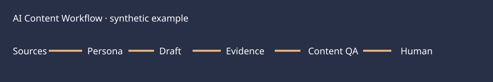

# AI Content Workflow

An independent clean-room content pipeline using only fictional sources and personas. It turns traceable claims into a channel draft, checks evidence and length, then stops for human review.

## Demo

Python 3.10+: `python3 content_workflow.py`; `python3 -m unittest discover -s tests`. The sample output is `output/draft.json` and stays `HUMAN_REVIEW` until `approve()` is called by a named reviewer.

## Problem and architecture

Source knowledge → persona → intent → deterministic draft → evidence check → channel style adaptation → QA → human review → export. Four kinds: brand, product, personal IP and store. Channels: web, X and email. [Architecture](docs/architecture.md) describes the control points. No company GEO prompt or customer data is used.

## Tests, eval, status

Seven tests cover claims, input validation, QA and approval. The draft is deterministic; an LLM provider, factuality eval and real publishing are `NOT_IMPLEMENTED`. Synthetic claims are `synthetic_unverified`; the evidence check only verifies source IDs exist, not that claims are true. See [resume bullets](docs/resume-bullets.md) and [interview notes](docs/interview-notes.md).

## Privacy, limitations and license

No live brand accounts or external API calls. Production would require source review, licensed assets, editorial approval, factuality eval and channel integration. MIT.
